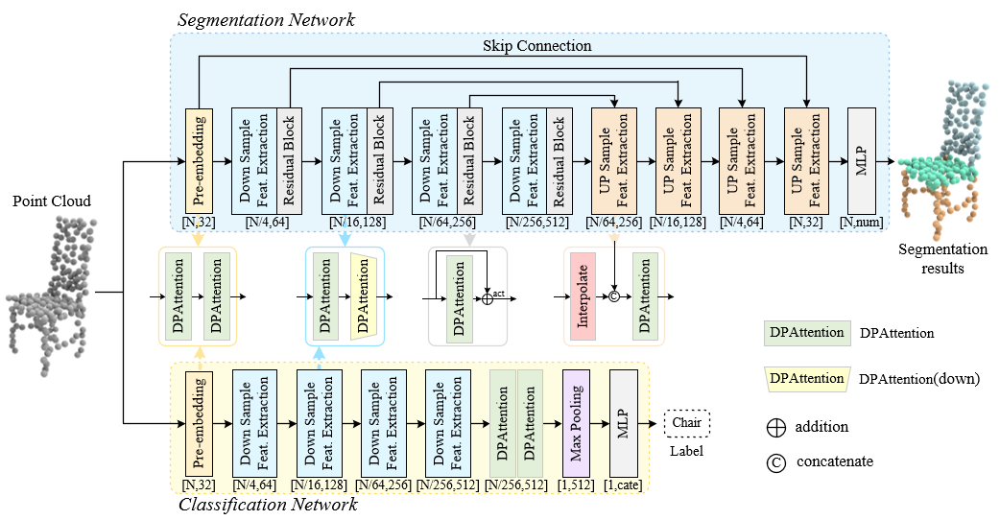

# DPAtteNet

## Unveiling the Power of Dual Positional Encoding in Point Cloud Learning with DPAtteNet

Traditional attention mechanisms in point cloud learning typically use a single type of positional encoding, which captures positional relationships within individual neighborhoods but neglects the spatial relationships between neighborhoods. Understanding these spatial relationships is crucial for grasping the overall shape of the point cloud and improving feature extraction. To address this, we propose Dual Positional Encoding Attention (DPAttention).
DPAttention combines global positional encoding to capture spatial relationships between neighborhoods with local positional encoding to address positional relationships within neighborhoods. This approach enables the model to effectively understand both the global geometric structure and the local details of the point cloud, thus enriching feature extraction through the attention mechanism.
Building on DPAttention, we introduce DPAtteNet, a deep learning network designed for point cloud classification and segmentation. We evaluated DPAtteNet on the ModelNet40, ShapeNet Part, and S3DIS datasets. The experimental results confirm the effectiveness of our method.  

<div  align="center">    
 
</div>

## 1. Requirements

- PyTorch >=1.7.0
- python >= 3.7
- CUDA >= 9.0
- GCC >= 4.9
- torchvision

```
pip install -r requirements.txt
```

## 2. Datasets

### ModelNet40

To use normal features for classification: You can get our sampled point clouds of ModelNet40 (XYZ and normal from mesh, 10k points per shape) [here (1.6GB)](https://shapenet.cs.stanford.edu/media/modelnet40_normal_resampled.zip). Set dataset path in [cfgs\modelnet40mormal\default.yaml](cfgs\modelnet40mormal\default.yaml)

### ScanObjectNN

Download from the [official website](https://hkust-vgd.github.io/scanobjectnn/). Set dataset path in [cfgs\scanobjectnn\default.yaml](cfgs\scanobjectnn\default.yaml)

### ShapeNet

Download from the [official website](https://shapenet.cs.stanford.edu/media/shapenetcore_partanno_segmentation_benchmark_v0_normal.zip). Set dataset path in [cfgs\shapenetpart\default.yaml](cfgs\shapenetpart\default.yaml)

## 3. DPAtteNet for Classification and Segmentation

### Synthetic 3D Classification

To train DPAtteNet on ModelNet40:
```
python examples\classification\main.py --cfg cfgs\modelnet40mormal\dpattenet.yaml
```
To evaluate DPAtteNet on ModelNet40:
```
python examples\classification\main.py --cfg cfgs\modelnet40mormal\dpattenet.yaml mode=test --pretrained_path [model path]
```

### Real-world 3D Classification

To train DPAtteNet on ScanObjestNN(hardest):
```
python examples\classification\main.py --cfg cfgs\scanobjectnn\dpattenet.yaml
```
To evaluate DPAtteNet on ScanObjestNN(hardest):
```
python examples\classification\main.py --cfg cfgs\scanobjectnn\dpattenet.yaml mode=test --pretrained_path [model path]
```

### Part Segmentation

To train DPAtteNet on ShapeNet, one can run
```
python examples\shapenetpart\main.py --cfg cfgs\shapenetpart\dpattenet.yaml
```
To evaluate CCMNet on ShapeNet, one can run
```
python examples\shapenetpart\main.py --cfg cfgs\shapenetpart\dpattenet.yaml mode=test --pretrained_path [model path]
```

## Acknowledgement

Our codes are built upon [PointNeXt](https://github.com/guochengqian/PointNeXt).